<div align="center">


# Sistema de Biblioteca

**Gestión de libros, usuarios y préstamos con reglas de negocio y panel de estadísticas.**


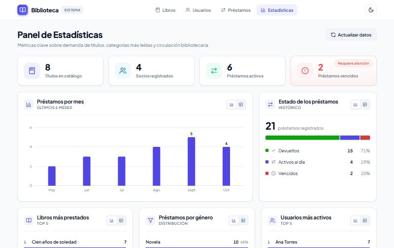

</div>

---

## Índice

1. [¿Qué hace la aplicación?](#qué-hace-la-aplicación)
2. [Capturas](#capturas)
3. [Requisitos previos](#requisitos-previos)
4. [Descargar el proyecto](#descargar-el-proyecto)
5. [Ponerlo en marcha paso a paso](#ponerlo-en-marcha-paso-a-paso)
6. [Comprobar que todo funciona](#comprobar-que-todo-funciona)
7. [Datos de ejemplo y registros de prueba](#datos-de-ejemplo-y-registros-de-prueba)
8. [Cómo funciona (diagramas)](#cómo-funciona-diagramas)
9. [Guía de uso por pantalla](#guía-de-uso-por-pantalla)
10. [Reglas de negocio y validaciones](#reglas-de-negocio-y-validaciones)
11. [API REST](#api-rest) · [Swagger](#documentación-interactiva-swagger)
12. [Pruebas automatizadas](#pruebas-automatizadas)
13. [Estructura del proyecto](#estructura-del-proyecto)
14. [Configuración](#configuración)
15. [Publicación en internet](#publicación-en-internet-rama-deployvercel-render)
16. [Solución de problemas](#solución-de-problemas)

---

## ¿Qué hace la aplicación?

| Módulo | Funcionalidad |
|---|---|
| **Libros** | Alta, edición, baja y búsqueda por título, autor o género. Control de ejemplares totales y disponibles, filtros (disponibles / agotados), vista de tabla o tarjetas y préstamo rápido. **Detección de duplicados:** si el libro ya existe, ofrece sumar los ejemplares en vez de crear otro registro; si solo cambia el género, muestra la diferencia para confirmarla. |
| **Usuarios** | Alta, edición y baja con validación del nombre y del correo (único). Los usuarios con préstamos no se pueden eliminar y la interfaz lo explica antes de intentarlo. |
| **Préstamos** | Registro con buscador de usuarios y de libros (por título o autor), devolución, historial **paginado en el servidor** con filtros por estado, búsqueda y orden, y cálculo automático del vencimiento. |
| **Estadísticas** | Indicadores clave y gráficas: préstamos por mes, estado de los préstamos, libros más prestados, préstamos por género y usuarios más activos. |

Además: botones de guardar que **no cambian de tamaño** mientras cargan (el indicador solo aparece si la espera es perceptible), errores mostrados **en contexto** (junto al campo o dentro del diálogo), **tema claro / oscuro**, diseño **responsive** (escritorio, tableta y móvil) y accesibilidad (teclado, lectores de pantalla y vista de tabla para cada gráfica).

**Tecnologías:**

| Capa | Tecnología |
|---|---|
| Frontend | Angular 22 (componentes standalone, signals, formularios reactivos), TypeScript, CSS |
| Backend | Spring Boot 4.1 (Spring MVC, Spring Data JPA, Bean Validation, Actuator), springdoc-openapi (Swagger UI), Java 21 |
| Base de datos | H2 en archivo (no requiere instalar nada) |
| Pruebas | JUnit 5, Mockito, MockMvc (backend) · Vitest (frontend) |

---

## Capturas

| Catálogo de libros | Préstamos vencidos |
|---|---|
| 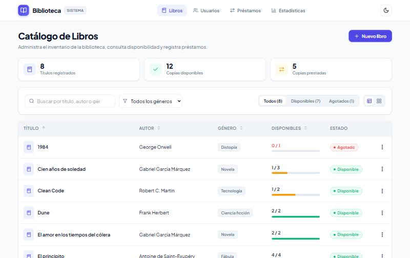 | 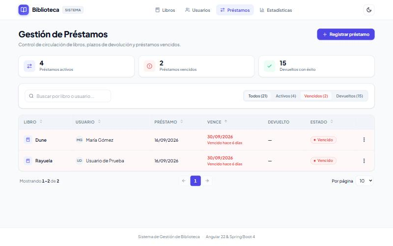 |
| **Validación del nombre de usuario** | **Estadísticas en modo oscuro** |
| 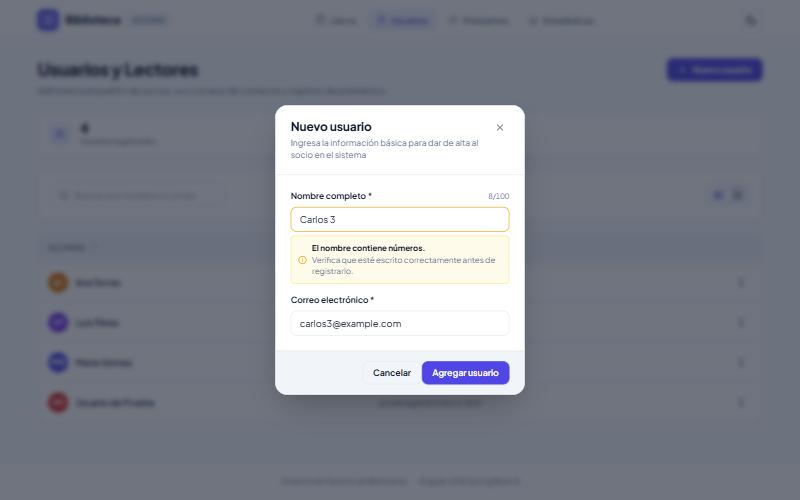 | 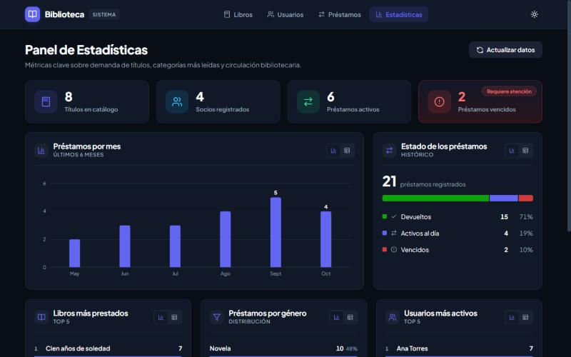 |
| **Historial paginado (página 2 de 3)** | **Documentación de la API (Swagger UI)** |
| 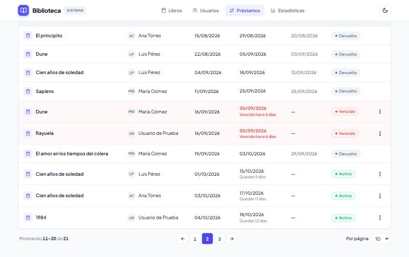 | 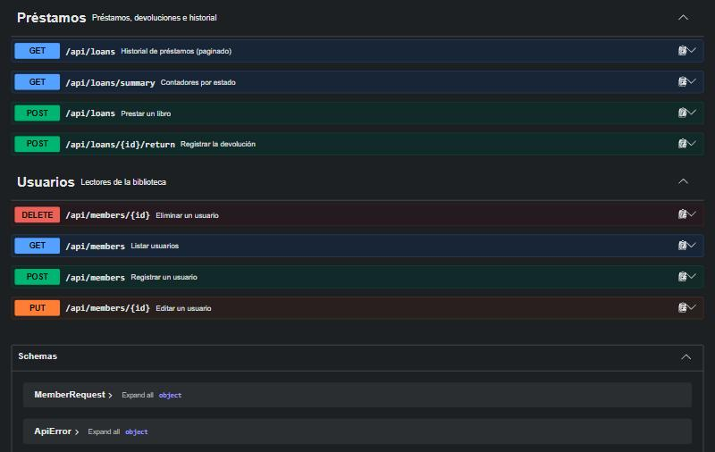 |
| **Libro ya registrado: sumar ejemplares** | **Mismo libro con otro género: confirmar** |
|  | 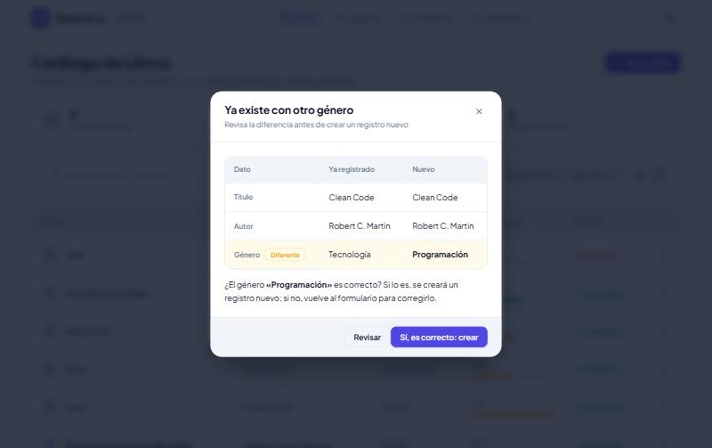 |

<p align="center">
  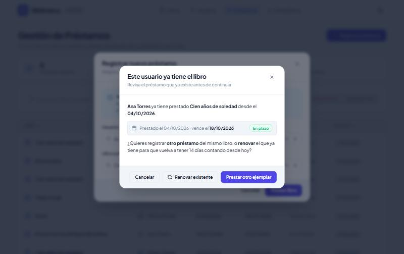<br/>
  <em>Préstamo repetido: el usuario ya tiene ese libro sin devolver; se puede renovar el existente o prestar otro ejemplar</em>
</p>

<p align="center">
  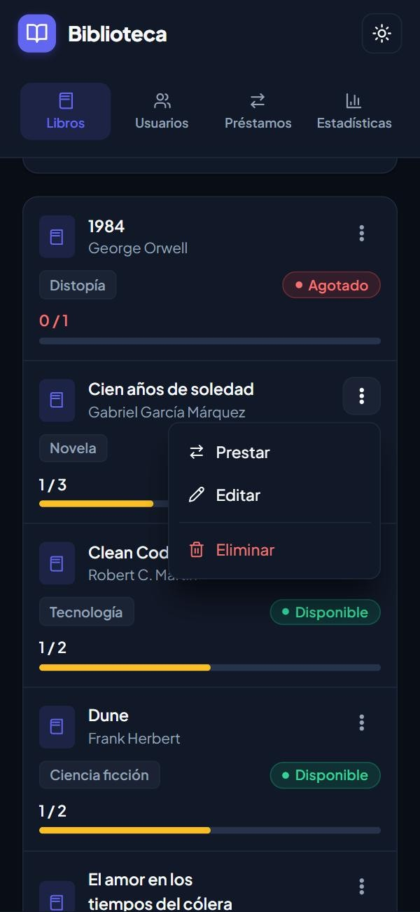<br/>
  <em>Vista móvil: cada libro es una tarjeta y sus acciones están en el menú ⋮</em>
</p>

---

## Requisitos previos

Solo necesitas instalar **tres programas**. **No** hace falta instalar Maven ni ninguna base de datos: el proyecto trae el *Maven Wrapper* y usa H2 embebida.

| Software | Versión | ¿Para qué? | Comprobar en una terminal | Descarga |
|---|---|---|---|---|
| **Git** | cualquiera reciente | Descargar el repositorio | `git --version` | [git-scm.com](https://git-scm.com/install/windows) |
| **JDK (Java)** | **21 o superior** | Compilar y ejecutar el backend | `java -version` | [Oracle JDK](https://www.oracle.com/java/technologies/downloads/) |
| **Node.js** (incluye npm) | **22.22+** (LTS) o **24.15+** | Instalar y ejecutar el frontend | `node -v` y `npm -v` | [nodejs.org](https://nodejs.org/) |

> [!IMPORTANT]
> Angular 22 **no funciona con Node 20 ni con versiones antiguas de Node 22**. Si `node -v` muestra una versión inferior a `v22.22`, instala la última LTS.
>
> La **primera** ejecución necesita **conexión a Internet**: descarga Maven, las dependencias de Java y los paquetes de npm. Después funciona sin conexión.

Puertos que usa la aplicación (deben estar libres):

| Servicio | Puerto | URL |
|---|---|---|
| Backend (API) | `8080` | http://localhost:8080 · documentación en http://localhost:8080/swagger-ui.html |
| Frontend (web) | `4200` | http://localhost:4200 |

---

## Descargar el proyecto

**Opción A — con Git (recomendada):**

```bash
git clone https://github.com/zseuz/biblioteca.git
```

```bash
cd biblioteca
```

**Opción B — sin Git:** en la página del repositorio pulsa **Code → Download ZIP**, descomprímelo y abre una terminal dentro de la carpeta `biblioteca`.

---

## Ponerlo en marcha paso a paso

La aplicación tiene dos partes que se ejecutan **a la vez, en dos terminales distintas**: primero el backend y después el frontend.

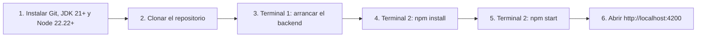

### Paso 1 — Backend (Terminal 1)

Entra en la carpeta del backend:

```bash
cd backend
```

Arráncalo según tu sistema operativo:

| Sistema | Comando |
|---|---|
| Windows (PowerShell) | `.\mvnw.cmd spring-boot:run` |
| Windows (CMD) | `mvnw.cmd spring-boot:run` |
| macOS / Linux | `./mvnw spring-boot:run` |

Está listo cuando la consola muestra:

```text
Tomcat started on port 8080 (http)
Started BibliotecaApplication in ... seconds
```

> La primera vez tarda unos minutos porque descarga Maven y las dependencias. **Deja esta terminal abierta.**

#### Alternativa: arrancar el backend desde un IDE (NetBeans, IntelliJ, VS Code)

1. Abre la carpeta **`backend`** como proyecto Maven (en NetBeans: *File → Open Project* y elige `backend`).
2. Espera a que el IDE descargue las dependencias.
3. Pulsa **Run** (▶). La clase principal es `com.biblioteca.BibliotecaApplication`; también puedes ejecutar directamente ese archivo.

> Si ya tienes el backend corriendo en una terminal, deténlo antes (`Ctrl + C`): dos instancias no pueden usar el puerto 8080 a la vez.

### Paso 2 — Frontend (Terminal 2)

Abre **otra** terminal en la carpeta del proyecto y entra en el frontend:

```bash
cd frontend
```

Instala las dependencias (solo la primera vez, o cuando cambie `package.json`):

```bash
npm install
```

Arranca el servidor de desarrollo:

```bash
npm start
```

Está listo cuando aparece:

```text
➜  Local:   http://localhost:4200/
```

### Paso 3 — Abrir la aplicación

Entra en **http://localhost:4200** con tu navegador.

### Detener la aplicación

Pulsa `Ctrl + C` en cada una de las dos terminales.

---

## Comprobar que todo funciona

| Qué comprobar | Cómo | Resultado esperado |
|---|---|---|
| El backend está vivo | Abrir http://localhost:8080/actuator/health | `{"status":"UP", ...}` |
| La API responde | Abrir http://localhost:8080/api/books | Lista de libros en JSON |
| Documentación de la API | Abrir http://localhost:8080/swagger-ui.html | Swagger UI con todos los endpoints |
| El frontend se conecta | Abrir http://localhost:4200 | Catálogo con 8 libros |
| Registros de prueba | Filtro **Agotados** en Libros y **Vencidos** en Préstamos; buscar «Fahrenheit» y «Cumbres» en Préstamos | «1984» agotado, «Rayuela» vencido, «Fahrenheit 451» renovado 3 veces y «Cumbres borrascosas» listo para renovar |

Si la web muestra *"No se pudo conectar con el servidor"*, el backend no está arrancado (revisa la Terminal 1).

---

## Datos de ejemplo y registros de prueba

En el **primer arranque** (base de datos vacía) se cargan automáticamente:

- **6 libros, 3 usuarios** y **seis meses de historial** de préstamos (devueltos, activos y uno vencido), para que las gráficas muestren tendencias desde el inicio. Las fechas son relativas al día actual.

En **cada arranque**, de forma idempotente (nunca se duplican), se garantizan estos **registros de prueba** (los dos primeros del usuario *Usuario de Prueba*, `prueba@biblioteca.test`; el tercero de *Lector Renovaciones*, `renovaciones@biblioteca.test`, y el cuarto de *Lector para Renovar*, `renovable@biblioteca.test`):

| Registro | Situación | Dónde verlo |
|---|---|---|
| **«1984»** de George Orwell | Su único ejemplar está prestado → **Agotado** | Libros → filtro *Agotados* |
| **«Rayuela»** de Julio Cortázar | Prestado hace 20 días con plazo de 14 → **Vencido** | Préstamos → filtro *Vencidos* |
| **«Fahrenheit 451»** de Ray Bradbury | Prestado hace 29 días y **renovado 3 veces** (hace 20, 11 y 2 días, cada vez en el primer día permitido) → sigue **Activo** | Préstamos → *Renovado 3 veces* abre el historial |
| **«Cumbres borrascosas»** de Emily Brontë | En plazo, prestado hace 11 días: le quedan **3 días**, así que **ya se puede renovar** (los demás préstamos activos todavía no) | Préstamos → ⋮ → *Renovar* |

Los datos se guardan en `backend/data/` (no se sube a Git). **Para reiniciar la base de datos:** detén el backend, borra la carpeta `backend/data/` y vuelve a arrancarlo.

---

## Cómo funciona (diagramas)

### Arquitectura general

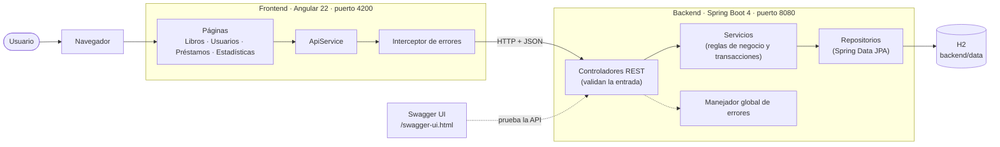

- El **frontend** es una aplicación de una sola página. Nunca habla con la base de datos; solo consume la API.
- El **backend** está organizado en capas: el controlador recibe la petición, el servicio aplica las reglas y el repositorio accede a los datos.
- Los errores se convierten siempre en un JSON uniforme, que el interceptor del frontend traduce a un mensaje claro.

### Modelo de datos

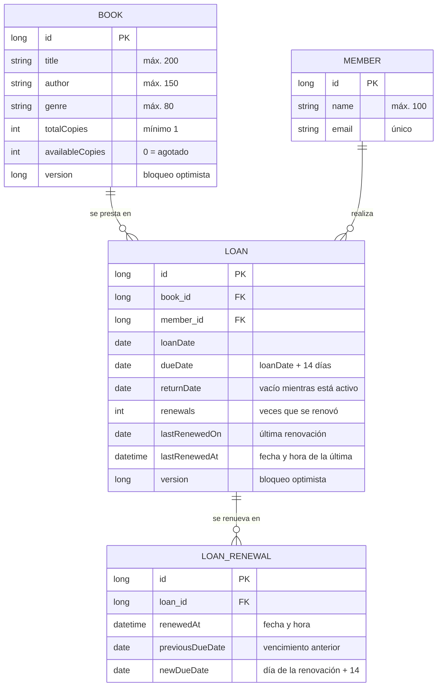

### Registrar un préstamo (secuencia completa)

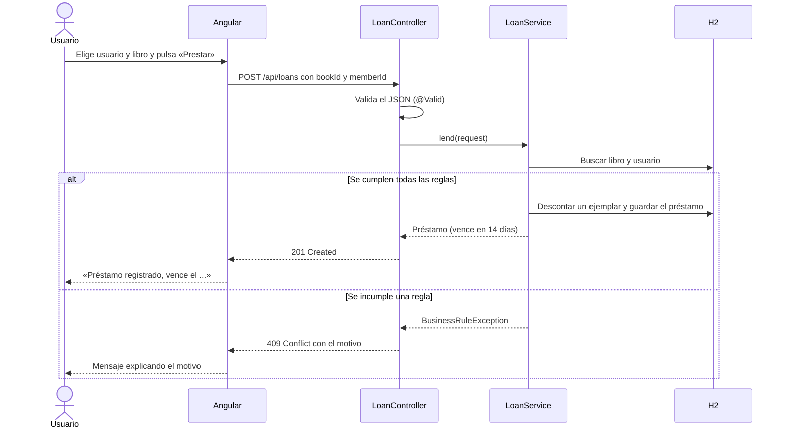

### Reglas que se comprueban al prestar

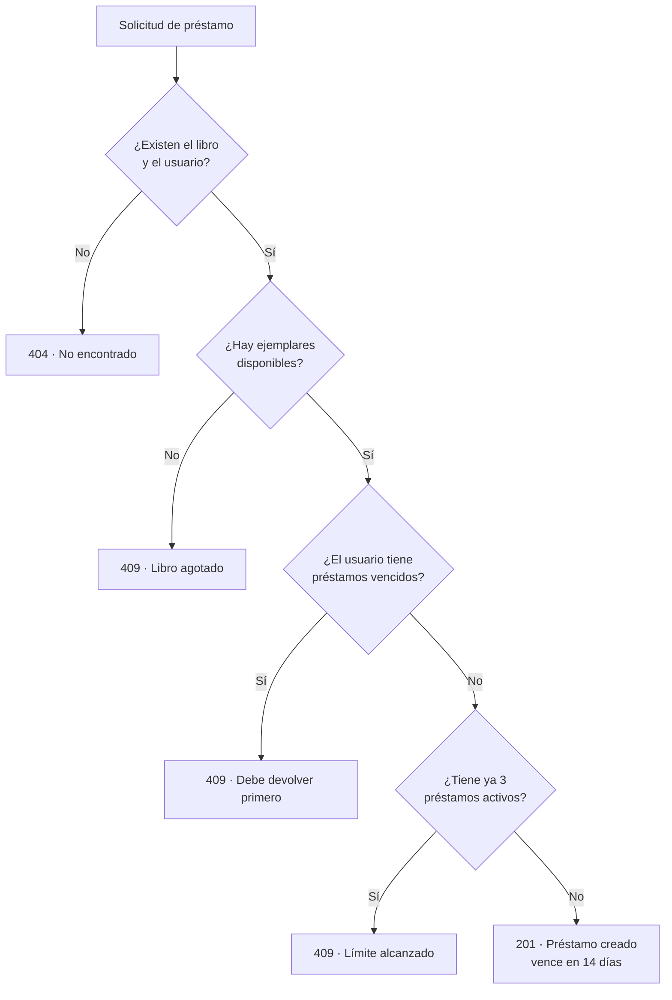

### Préstamo repetido y renovación

Antes de registrar un préstamo, la web consulta si el usuario ya tiene **ese mismo libro sin devolver**. Si es así, avisa desde qué fecha lo tiene y deja decidir:

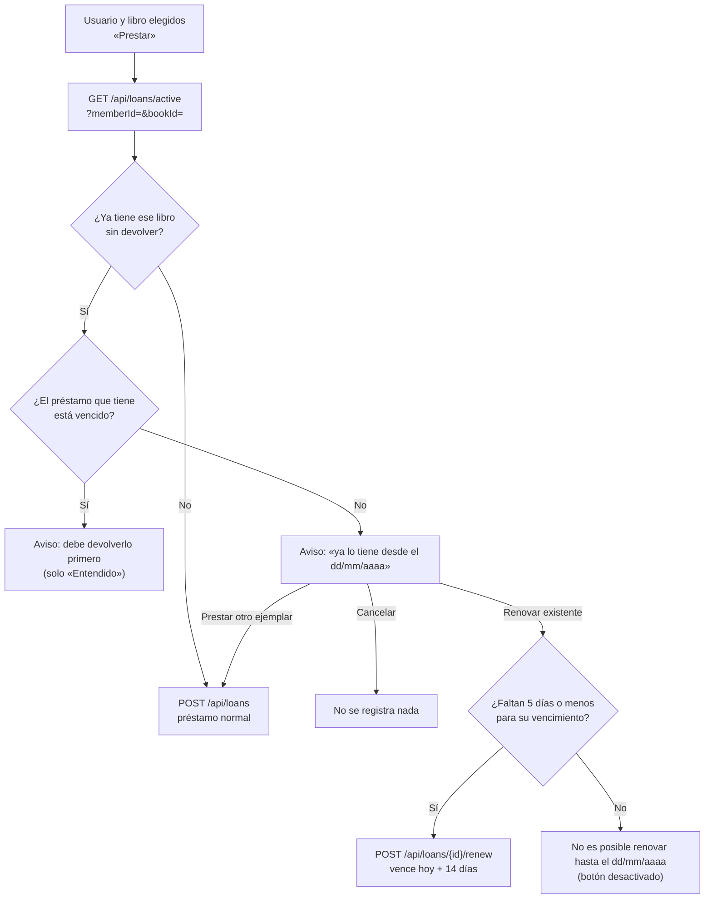

**Renovar** vuelve a dar el plazo completo **contando desde el día de la renovación** (la fecha del préstamo no cambia). Solo se renuevan préstamos **en plazo** (uno vencido debe devolverse) y **únicamente cuando faltan 5 días o menos para el vencimiento** (incluido el propio día de vencimiento). Antes de ese momento se informa *«No es posible renovar hasta el dd/mm/aaaa»*, que es la fecha de vencimiento menos 5 días. Eso incluye un préstamo recién hecho o recién renovado: tras renovar, el vencimiento queda a 14 días y no se podrá volver a renovar hasta 9 días después. No hay límite de renovaciones. Cada renovación queda en el **historial** (tabla `loan_renewal`) con su fecha y hora, el vencimiento anterior y el nuevo.

### Ciclo de vida de un préstamo

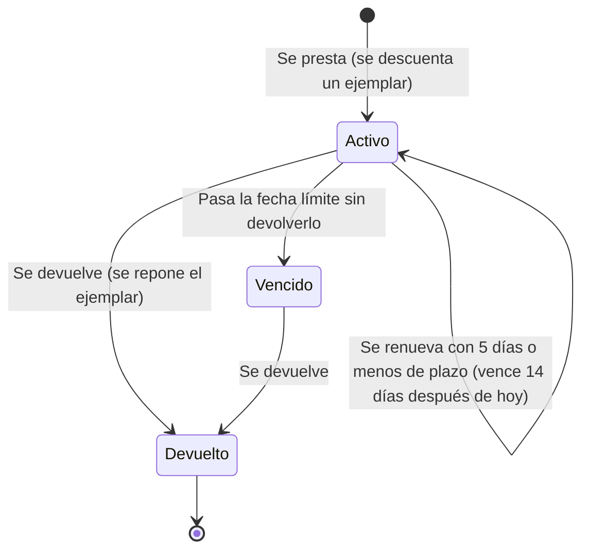

> Mientras un usuario tenga un préstamo **vencido**, no puede pedir más libros.

### Historial de préstamos paginado

Filtros, búsqueda, orden y paginación se resuelven en el servidor. El navegador solo recibe la página que muestra.

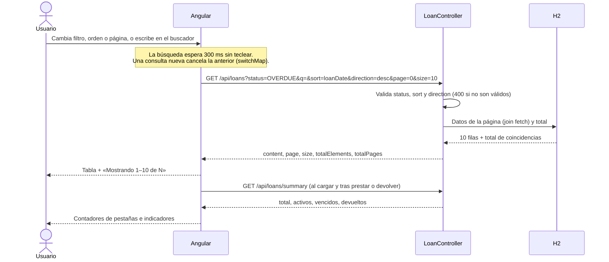

### Registrar un libro (detección de duplicados)

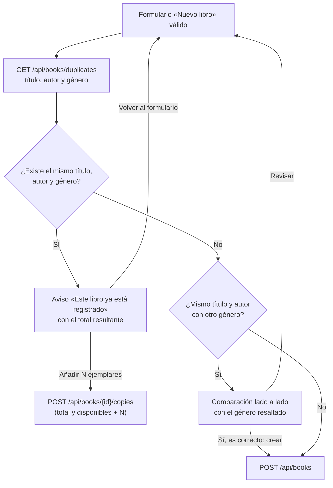

No se distinguen mayúsculas ni espacios sobrantes: «  cien años DE soledad » es el mismo libro que «Cien años de soledad». Aunque alguien llame a la API sin pasar por la interfaz, el backend rechaza con `409` crear o editar un libro idéntico a otro.

### Eliminar un usuario

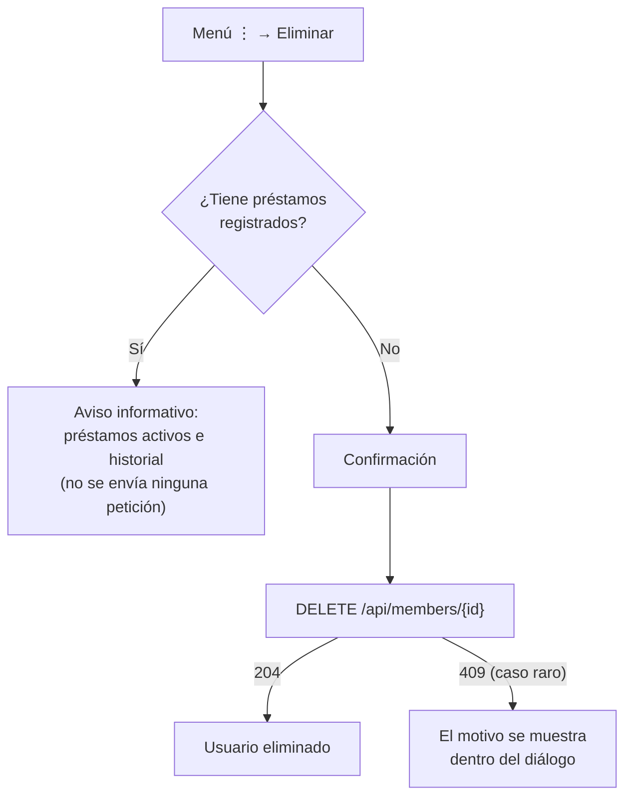

### Validación del nombre de usuario

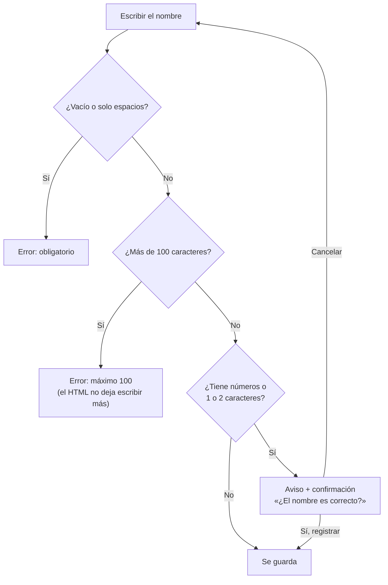

---

## Guía de uso por pantalla

**Sin datos o sin conexión.** Si una pantalla no tiene datos, lo indica (por ejemplo «No hay libros registrados» o «Todavía no hay préstamos») con un botón para agregar el primero; Estadísticas avisa en el panel y en cada gráfica. Si el servidor no responde, la pantalla muestra «No se pudieron cargar…» con un botón **Reintentar**, en lugar de dar a entender que no hay datos.

### Libros

- **Nuevo libro:** botón superior derecho. Todos los campos son obligatorios, con un mínimo y un máximo de caracteres (ver [límites de los formularios](#límites-de-los-formularios)) y entre 1 y 1000 ejemplares. Título y autor muestran un contador (p. ej. *900/200* en rojo) y cada error dice exactamente qué falla: vacío, demasiado corto o demasiado largo.
- **Género literario:** es un selector con búsqueda, tanto al crear como al editar. Al hacer clic muestra los géneros sugeridos (Novela, Terror, Ciencia ficción…) más los que ya tienen los libros del catálogo; al escribir filtra, y si lo escrito no está en la lista aparece **«Añadir género …»** para usar uno nuevo (máx. 80 caracteres). Lo que escribas queda como valor aunque no elijas una opción; si coincide con uno existente (sin distinguir mayúsculas ni tildes) se usa su grafía.
- **Buscar:** escribe en el buscador (título, autor o género); no distingue mayúsculas ni **tildes** («garcia» encuentra «García»). Combina la búsqueda con el filtro de género y con *Todos / Disponibles / Agotados*.
- **Ordenar:** haz clic en la cabecera de una columna.
- **Vista:** alterna entre tabla y tarjetas con los iconos de la derecha.
- **Libro repetido:** si registras un libro que ya existe (mismo título, autor y género), en lugar de duplicarlo se ofrece **sumar los ejemplares** que ibas a ingresar. Si solo cambia el género, se muestra la diferencia para que confirmes si es correcta o la corrijas.
- **Acciones (⋮):** *Prestar* (solo si hay ejemplares), *Editar* y *Eliminar*. Un libro con historial de préstamos no se puede eliminar.

### Usuarios

- **Nuevo usuario:** nombre (máx. 100 caracteres, con contador) y correo válido y único, de 6 a 150 caracteres. Si el correo ya está registrado, se indica **junto al campo** (que recibe el foco) sin cerrar el formulario.
- Si el nombre contiene **números** o tiene **1 o 2 caracteres**, aparece un aviso y se pide confirmación antes de guardarlo.
- **Eliminar:** si el usuario tiene préstamos, se explica por qué no es posible, sin intentarlo.

### Préstamos

- **Registrar préstamo:** el usuario y el libro se eligen con un **buscador**: al hacer clic muestra todas las opciones y al escribir filtra sin importar mayúsculas ni tildes. Los usuarios se buscan por nombre o correo; los libros, por **título o autor**, y solo aparecen los que tienen ejemplares disponibles (con cuántos quedan). Si aún no hay usuarios o libros con ejemplares disponibles, el formulario lo indica con un enlace a esa pantalla y no deja prestar.
- **Filtros:** *Todos, Activos, Vencidos, Devueltos*, más una búsqueda por libro o usuario (se aplica al dejar de escribir; tampoco distingue tildes). *Activos* son los que están **en plazo**; los que pasaron su fecha límite aparecen en *Vencidos*.
- **Orden:** por defecto se muestran primero los préstamos **más recientes** (fecha de préstamo descendente). Haz clic en la cabecera de una columna para ordenar por libro, usuario, fechas o estado; las fechas empiezan por la más reciente y un segundo clic invierte el orden.
- **Paginación:** abajo de la tabla se indica *Mostrando 11–20 de 21*, con botones de página y selector de 10, 20 o 50 por página. Filtros, búsqueda, orden y páginas se resuelven en el servidor.
- **Préstamo repetido:** si el usuario ya tiene ese libro sin devolver, se avisa desde qué fecha lo tiene y se ofrecen tres opciones: *Cancelar*, *Renovar existente* o *Prestar otro ejemplar*. Si ese préstamo está vencido, solo se informa que debe devolverlo. El mismo aviso aparece en el préstamo rápido desde Libros. Mientras se muestra, la ventana de préstamo se oculta (no queda detrás) y reaparece con lo elegido si se cancela.
- **Renovar:** menú ⋮ → *Renovar (14 días desde hoy)*, solo en préstamos **en plazo**. Tras confirmar, la nueva fecha límite se muestra en el aviso y la tabla indica cuántas veces se ha renovado. Solo se puede cuando faltan **5 días o menos** para el vencimiento; antes, en lugar de la confirmación aparece el aviso *«No es posible renovar hasta el dd/mm/aaaa»* (y, si se renovó hoy, a qué hora). En el aviso de préstamo repetido, el botón *Renovar existente* queda desactivado con la misma información.
- **Historial de renovaciones:** en la columna *Vence*, el enlace *Renovado N veces* abre el historial: arriba el **préstamo inicial** (fecha del préstamo, vencimiento original y vencimiento actual) y debajo cada renovación con su **fecha y hora** y cómo cambió la fecha límite (p. ej. *18/10/2026 → 21/10/2026, +3 días*).
- **Devolver:** menú ⋮ → *Registrar devolución* (solo en préstamos activos o vencidos).

### Estadísticas

- **Indicadores:** títulos, usuarios, préstamos activos y vencidos (este último se resalta en rojo si hay alguno). Igual que en Préstamos, *activos* son los que están **en plazo**; los vencidos se cuentan aparte.
- **Gráficas:** pasa el ratón (o navega con Tab) para ver el detalle. Cada tarjeta tiene un botón **Gráfica / Tabla** con los mismos datos en formato tabla.
- **Actualizar datos:** recarga el panel sin parpadeos.

---

## Reglas de negocio y validaciones

### Préstamos

| Regla | Valor | Configurable en |
|---|---|---|
| Plazo de devolución | 14 días | `library.loans.days` |
| Préstamos activos por usuario | máximo 3 | `library.loans.max-active` |
| Usuario con préstamos vencidos | no puede pedir más | — |
| Libro sin ejemplares disponibles | no se presta | — |
| Mismo libro ya prestado al usuario | se avisa y se pide confirmar (o renovar el existente) | — |
| Renovación | solo préstamos en plazo; nuevo vencimiento = hoy + 14 días | `library.loans.days` |
| Cuándo se puede renovar | solo cuando faltan **5 días o menos** para el vencimiento; antes se informa desde qué fecha | `library.loans.renewal-window-days` |
| Número de renovaciones | sin límite; cada una queda en el historial con fecha y hora | — |

### Altas, bajas y ediciones

- No puede haber dos libros con el mismo **título, autor y género** (sin distinguir mayúsculas ni espacios): se suman ejemplares al existente. El mismo título y autor con **otro género** sí se permite, previa confirmación.

- No se puede eliminar un **libro** o un **usuario** con historial de préstamos (para conservar la trazabilidad).
- No se puede reducir el total de ejemplares de un libro por debajo de los que están prestados.
- El correo de un usuario es único (sin distinguir mayúsculas).

### Límites de los formularios

Se validan en la web (con mensajes concretos) y otra vez en la API, que responde `400` con el motivo de cada campo. Los textos se cuentan **sin los espacios del inicio y del final**.

| Formulario | Campo | Obligatorio | Mínimo | Máximo |
|---|---|---|---|---|
| Libro | Título | Sí | 2 caracteres | 200 caracteres |
| Libro | Autor | Sí | 3 caracteres | 150 caracteres |
| Libro | Género | Sí | 3 caracteres | 80 caracteres |
| Libro | Ejemplares | Sí | 1 | 1000 (solo números enteros) |
| Usuario | Nombre | Sí | — (con 1 o 2 caracteres se pide confirmación) | 100 caracteres |
| Usuario | Correo | Sí, con formato válido | 6 caracteres | 150 caracteres |
| Préstamo | Usuario y libro | Sí (se eligen de una lista) | — | — |

### Validación del nombre de usuario (en las tres capas)

| Capa | Regla |
|---|---|
| HTML | `required` y `maxlength="100"` |
| Angular | `required`, sin solo espacios y `maxLength(100)`, con contador de caracteres |
| Backend | `@NotBlank` y `@Size(max = 100)` → `400` con el mensaje del campo |

Los nombres con números o de 1 o 2 caracteres **no se bloquean** (pueden ser legítimos): la interfaz avisa y pide confirmación.

---

## API REST

URL base: `http://localhost:8080/api`

| Método | Ruta | Descripción | Respuestas |
|---|---|---|---|
| `GET` | `/books?q=texto` | Lista o busca libros (título, autor o género; sin distinguir mayúsculas ni tildes) | 200 |
| `GET` | `/books/{id}` | Detalle de un libro | 200 · 404 |
| `POST` | `/books` | Crea un libro (409 si ya existe el mismo título, autor y género) | 201 · 400 · 409 |
| `PUT` | `/books/{id}` | Edita un libro | 200 · 400 · 404 · 409 |
| `DELETE` | `/books/{id}` | Elimina un libro sin historial | 204 · 404 · 409 |
| `GET` | `/books/duplicates?title=&author=&genre=` | Comprueba si ya existe: `sameBook` (idéntico) y `differentGenre` | 200 |
| `POST` | `/books/{id}/copies` | Suma ejemplares `{quantity}` (1-1000) a un libro existente | 200 · 400 · 404 |
| `GET` | `/members` | Lista usuarios con `activeLoans` y `totalLoans` | 200 |
| `POST` | `/members` | Crea un usuario | 201 · 400 · 409 |
| `PUT` | `/members/{id}` | Edita un usuario | 200 · 400 · 404 · 409 |
| `DELETE` | `/members/{id}` | Elimina un usuario sin historial | 204 · 404 · 409 |
| `GET` | `/loans?status=&q=&sort=&direction=&page=&size=` | Historial **paginado** (ver tabla de parámetros) | 200 · 400 |
| `GET` | `/loans/summary` | Contadores: total, activos, vencidos y devueltos | 200 |
| `POST` | `/loans` | Presta un libro `{bookId, memberId}` | 201 · 400 · 404 · 409 |
| `GET` | `/loans/active?memberId=&bookId=` | Préstamos sin devolver de un usuario para un libro (aviso de préstamo repetido) | 200 |
| `POST` | `/loans/{id}/renew` | Renueva un préstamo en plazo cuando faltan 5 días o menos para vencer: vence 14 días después de hoy. Antes, 409 con la fecha desde la que se podrá | 200 · 404 · 409 |
| `GET` | `/loans/{id}/renewals` | Historial: préstamo inicial y cada renovación con fecha, hora y vencimientos | 200 · 404 |
| `POST` | `/loans/{id}/return` | Registra la devolución | 200 · 404 · 409 |
| `GET` | `/stats` | Indicadores y series para las gráficas (`activeLoans` = en plazo, igual que `/loans/summary`) | 200 |

**Parámetros del historial paginado** (`GET /loans`):

| Parámetro | Valores | Por defecto |
|---|---|---|
| `status` | `ALL`, `ACTIVE` (en plazo), `OVERDUE` (vencido), `RETURNED` | `ALL` |
| `q` | Texto en el título del libro o el nombre del usuario (sin distinguir mayúsculas ni tildes) | — |
| `sort` | `bookTitle`, `memberName`, `loanDate`, `dueDate`, `status` | `loanDate` |
| `direction` | `asc`, `desc` | `desc` sin `sort` (los préstamos más recientes primero); `asc` si se indica `sort` |
| `page` | Número de página, desde 0 | `0` |
| `size` | Elementos por página (se acota entre 1 y 100) | `10` |

Respuesta:

```json
{
  "content": [ { "id": 7, "bookTitle": "Rayuela", "memberName": "Usuario de Prueba", "status": "OVERDUE", "...": "..." } ],
  "page": 0,
  "size": 10,
  "totalElements": 21,
  "totalPages": 3
}
```

**Ejemplo — crear un usuario:**

```bash
curl -X POST http://localhost:8080/api/members -H "Content-Type: application/json" -d "{\"name\":\"Laura Gomez\",\"email\":\"laura@example.com\"}"
```

**Formato de error** (igual en toda la API):

```json
{
  "timestamp": "2026-10-06T21:00:00Z",
  "status": 400,
  "message": "Datos inválidos",
  "path": "/api/members",
  "fields": { "name": "El nombre no puede superar los 100 caracteres" }
}
```

| Código | Significado |
|---|---|
| `400` | Datos inválidos (`fields` indica qué campo falla), JSON mal formado o parámetro no admitido (p. ej. `sort=password`) |
| `404` | El recurso no existe |
| `409` | Se incumple una regla de negocio o hubo un conflicto de concurrencia |
| `500` | Error inesperado (mensaje genérico; el detalle queda en el log del servidor) |

### Documentación interactiva (Swagger)

Con el backend en marcha, abre **http://localhost:8080/swagger-ui.html**. Ahí verás todos los endpoints agrupados (Libros, Usuarios, Préstamos, Estadísticas), con sus parámetros, los modelos de datos y los posibles errores, y podrás **probarlos desde el navegador** con *Try it out*. La especificación OpenAPI en JSON está en http://localhost:8080/v3/api-docs.

La documentación se genera a partir del propio código (controladores, DTOs y validaciones), así que siempre está sincronizada con la API.

---

## Pruebas automatizadas

| Proyecto | Comando | Qué cubre |
|---|---|---|
| Backend (62 tests) | `cd backend` y después `./mvnw test` (Windows: `.\mvnw.cmd test`) | Reglas del dominio, reglas de préstamo con reloj fijo, integración HTTP → JPA → H2, búsquedas sin tildes, errores 400 por parámetros ausentes, longitudes mínimas y máximas de cada campo, historial paginado (filtros, búsqueda, orden, páginas), detección de libros duplicados, renovación (ventana de 5 días, historial) y préstamo repetido, y **concurrencia real** (10 hilos compitiendo por el último ejemplar). Spring arranca una sola vez para todas (clase base `IntegrationTest`) |
| Frontend (107 tests) | `cd frontend` y después `npm test -- --watch=false` | Servicio de API, interceptor, páginas, validaciones (obligatorio, mínimo y máximo de cada campo), pantallas sin datos o sin conexión, menú de acciones, buscador (sin tildes), paginador, consultas al servidor, aviso de libro duplicado, aviso de préstamo repetido, renovación, historial de renovaciones, selector de género y estados de carga de los botones |

Los tests del backend usan una base H2 **en memoria**, así que nunca modifican tus datos.

---

## Estructura del proyecto

```text
biblioteca/
├── backend/                         API REST (Spring Boot)
│   ├── mvnw, mvnw.cmd               Maven Wrapper (no hace falta instalar Maven)
│   ├── pom.xml                      Dependencias
│   └── src/
│       ├── main/java/com/biblioteca/
│       │   ├── web/                 Controladores REST
│       │   ├── service/             Casos de uso y reglas de negocio
│       │   ├── repository/          Acceso a datos (JPA) y búsqueda paginada (LoanSearchRepositoryImpl)
│       │   ├── domain/              Entidades: Book, Member, Loan
│       │   ├── dto/                 Contratos de entrada y salida de la API
│       │   ├── exception/           Errores y manejador global
│       │   ├── config/              Parámetros de negocio (LibraryProperties) y Swagger (OpenApiConfig)
│       │   └── DataSeeder.java      Datos de ejemplo y registros de prueba
│       ├── main/resources/application.properties
│       └── test/                    Tests unitarios y de integración
├── frontend/                        Aplicación web (Angular)
│   ├── public/favicon.svg           Icono de la aplicación
│   └── src/
│       ├── styles.css               Tema claro/oscuro y estilos globales
│       └── app/
│           ├── core/                ApiService, interceptor, modelos, validaciones
│           ├── pages/               Libros, Usuarios, Préstamos, Estadísticas
│           └── shared/              Modal, menú ⋮, buscador, paginador, gráficas, iconos
└── docs/img/                        Capturas usadas en este README
```

---

## Configuración

Ajustes principales en `backend/src/main/resources/application.properties`. Todos se pueden sobrescribir con variables de entorno, sin tocar el código:

| Propiedad | Por defecto | Variable de entorno | Descripción |
|---|---|---|---|
| `server.port` | `8080` | `SERVER_PORT` | Puerto de la API |
| `spring.datasource.url` | `jdbc:h2:file:./data/biblioteca` | `SPRING_DATASOURCE_URL` | Ubicación de la base de datos |
| `library.loans.days` | `14` | `LIBRARY_LOANS_DAYS` | Días de plazo de un préstamo |
| `library.loans.max-active` | `3` | `LIBRARY_LOANS_MAX_ACTIVE` | Préstamos activos por usuario |
| `library.loans.renewal-window-days` | `5` | `LIBRARY_LOANS_RENEWAL_WINDOW_DAYS` | Un préstamo solo se renueva cuando faltan estos días o menos para vencer |
| `app.cors.allowed-origins` | `http://localhost:4200` | `CORS_ALLOWED_ORIGINS` | Origen permitido para el frontend |
| `springdoc.swagger-ui.path` | `/swagger-ui.html` | `SPRINGDOC_SWAGGER_UI_PATH` | Ruta de la documentación interactiva |

La URL de la API que usa el frontend está en `frontend/src/app/core/api.service.ts` (`API_URL`).

---

## Publicación en internet (rama `deploy/vercel-render`)

> Esta sección solo existe en la rama **`deploy/vercel-render`**. La rama `main` es la versión para ejecutar en local y no cambia.

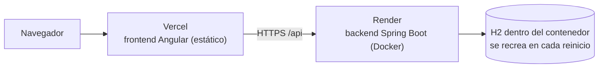

| Parte | Plataforma | Archivo de configuración |
|---|---|---|
| Frontend | **Vercel** | `frontend/vercel.json` y `frontend/src/environments/environment.ts` |
| Backend | **Render** (plan gratuito) | `render.yaml` y `backend/Dockerfile` |

**Diferencias con la versión local:**

- La URL de la API sale de `src/environments/`: `ng serve` usa `environment.development.ts` (localhost) y `ng build` usa `environment.ts` (Render).
- En el plan gratuito de Render el disco no es persistente: la base H2 **se vuelve a crear en cada despliegue o reinicio**, con los datos de demostración y los registros de prueba. Además, el servicio se duerme tras unos 15 minutos sin uso; la primera petición después puede tardar entre 30 y 60 segundos.

### 1. Backend en Render

1. Entra en [render.com](https://render.com) con tu cuenta de GitHub.
2. **New → Blueprint** y elige el repositorio `zseuz/biblioteca`, rama `deploy/vercel-render`. Render lee `render.yaml` y crea el servicio `biblioteca-api`.
3. Cuando pida `CORS_ALLOWED_ORIGINS`, escribe la URL que tendrá el frontend en Vercel (por ejemplo `https://biblioteca.vercel.app`). Si aún no la conoces, pon cualquiera y cámbiala después en *Environment*.
4. Al terminar, comprueba `https://<tu-servicio>.onrender.com/actuator/health` → `{"status":"UP"}`.

### 2. Frontend en Vercel

1. Si la URL de Render **no** es `https://biblioteca-api-se8r.onrender.com` (la actual), cámbiala en `frontend/src/environments/environment.ts` y haz push a esta rama.
2. Entra en [vercel.com](https://vercel.com) con tu cuenta de GitHub → **Add New → Project** → importa `zseuz/biblioteca`.
3. En **Root Directory** elige `frontend`. El resto (instalación, build y carpeta de salida) ya está en `frontend/vercel.json`.
4. En **Settings → Git → Production Branch** pon `deploy/vercel-render`, para que se publique esta rama y no `main`.
5. Despliega y abre la URL que te asigne Vercel. Si es distinta de la que pusiste en el paso 3 de Render, actualiza `CORS_ALLOWED_ORIGINS` en Render.

Desde ese momento, cada push a `deploy/vercel-render` vuelve a publicar ambas partes. Para llevar a esta rama cambios nuevos de `main`: `git checkout deploy/vercel-render` y luego `git merge main`.

---

## Solución de problemas

| Síntoma | Causa probable | Solución |
|---|---|---|
| `java` no se reconoce como comando | JDK no instalado o fuera del PATH | Instala el JDK 21 o superior y abre una terminal nueva |
| `release version 21 not supported` | JDK anterior a 21 | Instala JDK 21 o superior y comprueba `java -version` |
| `./mvnw: Permission denied` (macOS/Linux) | El script no es ejecutable | `chmod +x mvnw` |
| `Port 8080 was already in use` | Otra instancia del backend sigue abierta | Ciérrala o cambia el puerto con `SERVER_PORT=8081` (y `API_URL` en el frontend) |
| NetBeans: `Could not find or load main class ${start-class}` | Versión del proyecto anterior a la corrección | Actualiza el repositorio (`git pull`): el `pom.xml` ya define la clase principal |
| Swagger o endpoints nuevos devuelven 404 | El backend que está corriendo es una versión anterior | Detén el backend y arráncalo de nuevo con el código actual |
| `npm install` falla o `ng` exige otra versión de Node | Node antiguo | Instala Node 22.22+ LTS o 24.15+ |
| La web dice *"No se pudo conectar con el servidor"* | El backend no está arrancado | Arranca el backend (Terminal 1) y recarga la página |
| Error de CORS en la consola del navegador | El frontend usa otro puerto u origen | Ajusta `CORS_ALLOWED_ORIGINS` |
| Quiero empezar con los datos de ejemplo limpios | — | Detén el backend, borra `backend/data/` y arráncalo de nuevo |
| Las gráficas aparecen vacías | Base de datos sin historial | Registra préstamos o reinicia los datos de ejemplo |
